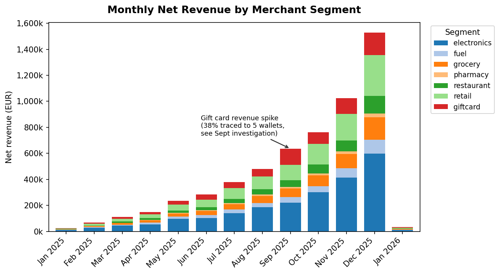
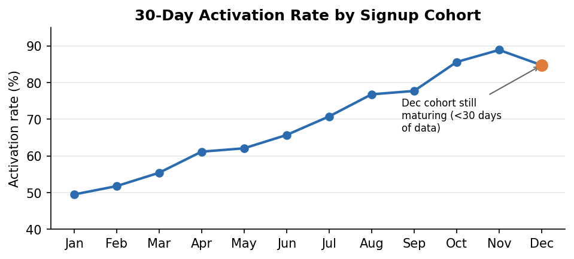

# Commercial & Onboarding Health Summary

**Prepared by:** Mohamed Neder Hachana | **Prepared for:** COO | **Data window:** Jan 2025 – Jan 2026 (partial)

## Key findings

**1. Net revenue is growing strongly and broadly.** Monthly net revenue (authorized minus refunds minus reversals) grew roughly 60x from January to December (€25,334 → €1,529,520) across every merchant segment, not just one or two categories. Electronics and Retail are the largest segments in absolute terms; Gift Card is the fastest-growing relative to its size.

**2. Onboarding is getting healthier every month.** The share of new wallets that make at least one successful payment within 30 days of signing up ("activation") rose from **49.5% in January to 88.9% in November**, a steady consistent improvement, not a one-off jump. December shows a dip to 84.7%, but this cohort hasn't had its full 30-day window yet in the data we have, so this is very likely a measurement artifact, not a real decline.

**3. A September gift card spike deserves Risk's attention.** Gift Card segment revenue more than doubled in September (€59k → €127k) before partially retreating in October. Investigating why: **5 wallets**, previously showing entirely ordinary activity, each suddenly made 19–29 transactions between **September 3–15**. Every one of these 131 transactions succeeded (100% authorization, vs. 82.6% normal), all were Gift Card purchases, spread across 23 different merchants, and these 5 wallets together account for **38% of that month's entire Gift Card revenue growth** (€48,987 of the spike). A similar but structurally different pattern of high-velocity wallets also appears across late November–December, but those are genuinely holiday sales peak, the September cluster has no such explanation and starts on almost the same hour for five unrelated wallets. **My working hypothesis: this combination of synchronized timing across unrelated wallets, a 100% success rate, and concentration in a single liquid/resellable category is consistent with card testing or a fraud ring cashing out via gift cards.** That's a hypothesis based on the transaction pattern, not a confirmed diagnosis see caveats below. **Recommend Risk review these 5 wallets, using device/IP/KYC data we don't have here, before counting their revenue toward normal Gift Card growth.**

**4. Data completeness matters for the numbers above.** ~1% of transactions (740 of 74,776, after removing exact duplicate rows) reference a wallet_id that doesn't exist in our wallet recordsm these are kept in the revenue figures above (dropping them would understate revenue) but excluded from anything wallet-level, like the activation and cohort numbers.

## Monthly net revenue by segment

## 30-day activation rate by signup cohort

## Data caveats & assumptions

- **373 exact duplicate transaction rows** were found in the raw data (identical across every column) and removed before any analysis, most likely a duplicate ingestion/webhook-retry issue upstream.
- **740 transactions (~1%) have a wallet_id that isn't in our wallet records** (743 in the raw data before deduplication, 3 were duplicate copies of already-orphaned rows). These are kept in revenue totals (Finding 1) but flagged and excluded from wallet-level analysis (Findings 2 and 3: structurally in Finding 2, since that analysis starts from the real wallet "dim_wallet" list rather than from transactions, and via an explicit filter in Finding 3), since we can't attribute them to a specific customer.
- **Net revenue nets off refunds/reversals in the month they happen**, not the month of the original purchase, since the data doesn't link a refund back to its original transaction. This matches how the numbers would show up in a cash-basis view.
- **The September finding is based on pattern analysis, not confirmed fraud.** Five wallets showing synchronized, unusually successful, multi-merchant transaction bursts is a strong statistical signal worth investigating, not a proven conclusion. I'd want Risk's tooling (device/IP data, KYC history) to confirm before taking action on the accounts.
- **December's activation rate is understated** because that cohort hasn't had its full 30-day window in the available data, treat it as provisional.
